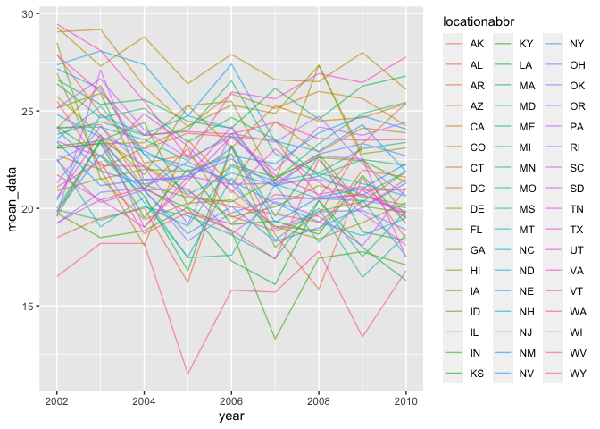
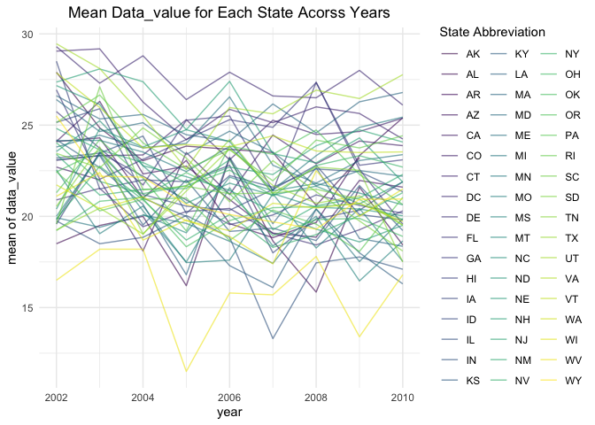
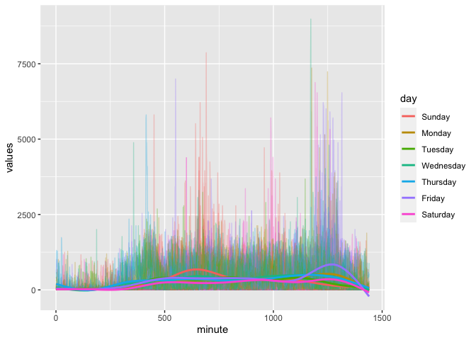

p8105_hw3_pw2551
================
Paula Wu
10/14/2021

Import the library:

``` r
library(tidyverse)
library(viridis)
library(p8105.datasets)
library(lubridate)
```

### Problem 1

Load in dataset

``` r
data("instacart")
```

``` r
# it would be easier to store this as a new variable
aisles = 
  instacart %>% 
  group_by(aisle_id, aisle) %>% 
  summarize(n_obs = n()) %>% 
  arrange(desc(n_obs))  # arrange in descending order
```

    ## `summarise()` has grouped output by 'aisle_id'. You can override using the `.groups` argument.

``` r
#knitr::kable(aisles[1:5,])
aisles
```

    ## # A tibble: 134 × 3
    ## # Groups:   aisle_id [134]
    ##    aisle_id aisle                          n_obs
    ##       <int> <chr>                          <int>
    ##  1       83 fresh vegetables              150609
    ##  2       24 fresh fruits                  150473
    ##  3      123 packaged vegetables fruits     78493
    ##  4      120 yogurt                         55240
    ##  5       21 packaged cheese                41699
    ##  6      115 water seltzer sparkling water  36617
    ##  7       84 milk                           32644
    ##  8      107 chips pretzels                 31269
    ##  9       91 soy lactosefree                26240
    ## 10      112 bread                          23635
    ## # … with 124 more rows

There are 134 aisles. Aisle number 83 (fresh vegetables) has the most
item orders with 150609 observations, followed by aisle number 24 (fresh
fruits) with 150473 observations. <br> <br> Making plots

``` r
instacart %>% 
  count(aisle) %>% 
  filter(n > 10000) %>% 
  mutate(aisle = fct_reorder(aisle, n)) %>% 
  ggplot(aes(x = aisle, y = n)) +
  geom_point()+
  theme(axis.text.x = element_text(angle = 90, vjust = 0.5, hjust= 1))
```

<!-- -->

Make a table: best-selling

``` r
table_1 = 
  instacart %>% 
  filter(aisle %in% c("baking ingredients","dog food care", "packaged vegetables fruits")) %>% 
  group_by(product_name, aisle) %>% 
  summarize(times = n()) %>% 
  arrange(desc(times)) %>% 
  group_by(aisle) %>% 
  top_n(3) %>% 
  unite("products", c(product_name,times), sep = ": ") %>% # for better looking table
  mutate(rank = c(1,2,3)) %>% 
  pivot_wider(names_from = aisle, values_from = products)
```

    ## `summarise()` has grouped output by 'product_name'. You can override using the `.groups` argument.

    ## Selecting by times

``` r
#knitr::kable(table_1)
table_1
```

    ## # A tibble: 3 × 4
    ##    rank `packaged vegetables fruits` `baking ingredients`   `dog food care`     
    ##   <dbl> <chr>                        <chr>                  <chr>               
    ## 1     1 Organic Baby Spinach: 9784   Light Brown Sugar: 499 Snack Sticks Chicke…
    ## 2     2 Organic Raspberries: 5546    Pure Baking Soda: 387  Organix Chicken & B…
    ## 3     3 Organic Blueberries: 4966    Cane Sugar: 336        Small Dog Biscuits:…

Make a table: mean hour

``` r
table_2 = 
  instacart %>% 
  filter(product_name == "Pink Lady Apples" | product_name == "Coffee Ice Cream") %>% 
  select(c(order_dow, order_hour_of_day, product_name)) %>% 
  mutate(order_day = wday(order_dow+1, label = TRUE, abbr = FALSE)) %>% 
  group_by(order_day, product_name) %>% 
  summarize(mean_hour = mean(order_hour_of_day)) %>%  # just the mean? 
  spread(key = order_day, value = mean_hour)
```

    ## `summarise()` has grouped output by 'order_day'. You can override using the `.groups` argument.

``` r
table_2
```

    ## # A tibble: 2 × 8
    ##   product_name     Sunday Monday Tuesday Wednesday Thursday Friday Saturday
    ##   <chr>             <dbl>  <dbl>   <dbl>     <dbl>    <dbl>  <dbl>    <dbl>
    ## 1 Coffee Ice Cream   13.8   14.3    15.4      15.3     15.2   12.3     13.8
    ## 2 Pink Lady Apples   13.4   11.4    11.7      14.2     11.6   12.8     11.9

### Problem 2

Load in data set

``` r
data("brfss_smart2010")
```

Data Cleaning

``` r
brfss = 
  brfss_smart2010 %>% 
  janitor::clean_names() %>% 
  filter(topic == "Overall Health") %>% 
  filter(response %in% c("Excellent", "Very good", "Good", "Fair", "Poor")) %>%
  mutate(response = factor(response, levels = c("Excellent", "Very good", "Good", "Fair", "Poor"))) %>% 
  arrange(desc(response))
brfss
```

    ## # A tibble: 10,625 × 23
    ##     year locationabbr locationdesc  class  topic  question  response sample_size
    ##    <int> <chr>        <chr>         <chr>  <chr>  <chr>     <fct>          <int>
    ##  1  2010 AL           AL - Jeffers… Healt… Overa… How is y… Poor              45
    ##  2  2010 AL           AL - Mobile … Healt… Overa… How is y… Poor              66
    ##  3  2010 AL           AL - Tuscalo… Healt… Overa… How is y… Poor              35
    ##  4  2010 AZ           AZ - Maricop… Healt… Overa… How is y… Poor              62
    ##  5  2010 AZ           AZ - Pima Co… Healt… Overa… How is y… Poor              49
    ##  6  2010 AZ           AZ - Pinal C… Healt… Overa… How is y… Poor              30
    ##  7  2010 AR           AR - Benton … Healt… Overa… How is y… Poor              21
    ##  8  2010 AR           AR - Pulaski… Healt… Overa… How is y… Poor              36
    ##  9  2010 AR           AR - Washing… Healt… Overa… How is y… Poor              16
    ## 10  2010 CA           CA - Alameda… Healt… Overa… How is y… Poor              23
    ## # … with 10,615 more rows, and 15 more variables: data_value <dbl>,
    ## #   confidence_limit_low <dbl>, confidence_limit_high <dbl>,
    ## #   display_order <int>, data_value_unit <chr>, data_value_type <chr>,
    ## #   data_value_footnote_symbol <chr>, data_value_footnote <chr>,
    ## #   data_source <chr>, class_id <chr>, topic_id <chr>, location_id <chr>,
    ## #   question_id <chr>, respid <chr>, geo_location <chr>

2002 vs 2010:

``` r
brfss %>% 
  filter(year %in% c(2002,2010)) %>%
  select(c(year, locationabbr, locationdesc)) %>% 
  distinct(year, locationabbr, locationdesc) %>% 
  group_by(year, locationabbr) %>% 
  summarize(n_obs = n()) %>% 
  filter(n_obs > 7) %>% 
  arrange(n_obs)
```

    ## `summarise()` has grouped output by 'year'. You can override using the `.groups` argument.

    ## # A tibble: 14 × 3
    ## # Groups:   year [2]
    ##     year locationabbr n_obs
    ##    <int> <chr>        <int>
    ##  1  2002 MA               8
    ##  2  2002 NJ               8
    ##  3  2010 OH               8
    ##  4  2010 MA               9
    ##  5  2010 NY               9
    ##  6  2002 PA              10
    ##  7  2010 NE              10
    ##  8  2010 WA              10
    ##  9  2010 CA              12
    ## 10  2010 MD              12
    ## 11  2010 NC              12
    ## 12  2010 TX              16
    ## 13  2010 NJ              19
    ## 14  2010 FL              41

Data set limited to `Excellent`:

``` r
excellent = 
  brfss %>% 
  filter(response == "Excellent") %>%
  group_by(locationabbr, year) %>% 
  summarize(mean_data = mean(data_value, na.rm = TRUE)) %>% 
  ggplot(aes(x = year, y = mean_data, group = locationabbr, color = locationabbr)) + 
  geom_line(alpha = 0.6)
```

    ## `summarise()` has grouped output by 'locationabbr'. You can override using the `.groups` argument.

``` r
excellent
```

<!-- -->
Distribution of `data_value` for responses

``` r
nys = 
  brfss %>% 
  filter(locationabbr=="NY" & year %in% c(2006, 2010)) %>% 
  arrange(year)
nys
```

    ## # A tibble: 75 × 23
    ##     year locationabbr locationdesc  class  topic  question  response sample_size
    ##    <int> <chr>        <chr>         <chr>  <chr>  <chr>     <fct>          <int>
    ##  1  2006 NY           NY - Kings C… Healt… Overa… How is y… Poor              26
    ##  2  2006 NY           NY - Nassau … Healt… Overa… How is y… Poor              14
    ##  3  2006 NY           NY - New Yor… Healt… Overa… How is y… Poor              26
    ##  4  2006 NY           NY - Queens … Healt… Overa… How is y… Poor              16
    ##  5  2006 NY           NY - Suffolk… Healt… Overa… How is y… Poor              10
    ##  6  2006 NY           NY - Westche… Healt… Overa… How is y… Poor               8
    ##  7  2006 NY           NY - Kings C… Healt… Overa… How is y… Fair              73
    ##  8  2006 NY           NY - Nassau … Healt… Overa… How is y… Fair              39
    ##  9  2006 NY           NY - New Yor… Healt… Overa… How is y… Fair              55
    ## 10  2006 NY           NY - Queens … Healt… Overa… How is y… Fair              64
    ## # … with 65 more rows, and 15 more variables: data_value <dbl>,
    ## #   confidence_limit_low <dbl>, confidence_limit_high <dbl>,
    ## #   display_order <int>, data_value_unit <chr>, data_value_type <chr>,
    ## #   data_value_footnote_symbol <chr>, data_value_footnote <chr>,
    ## #   data_source <chr>, class_id <chr>, topic_id <chr>, location_id <chr>,
    ## #   question_id <chr>, respid <chr>, geo_location <chr>

``` r
ggplot(nys, aes(x = response, y = data_value)) + 
  geom_boxplot(width = 0.3) +
  facet_grid(.~year)
```

<!-- -->

### Problem 3

Loading and tidying data

``` r
accel = read_csv("./data/accel_data.csv") %>% 
  janitor::clean_names() %>% 
  pivot_longer(activity_1:activity_1440, names_to = "minute", names_prefix = "activity_",values_to = "values") %>% 
  mutate(minute = as.numeric(minute),
         day = as.factor(day),
         type_of_days = ifelse(day %in% c('Sunday', 'Saturday'), 'weekend', 'weekday'),
         day = fct_relevel(day, "Sunday", "Monday", "Tuesday", "Wednesday", "Thursday", "Friday", "Saturday"))
accel
```

    ## # A tibble: 50,400 × 6
    ##     week day_id day    minute values type_of_days
    ##    <dbl>  <dbl> <fct>   <dbl>  <dbl> <chr>       
    ##  1     1      1 Friday      1   88.4 weekday     
    ##  2     1      1 Friday      2   82.2 weekday     
    ##  3     1      1 Friday      3   64.4 weekday     
    ##  4     1      1 Friday      4   70.0 weekday     
    ##  5     1      1 Friday      5   75.0 weekday     
    ##  6     1      1 Friday      6   66.3 weekday     
    ##  7     1      1 Friday      7   53.8 weekday     
    ##  8     1      1 Friday      8   47.8 weekday     
    ##  9     1      1 Friday      9   55.5 weekday     
    ## 10     1      1 Friday     10   43.0 weekday     
    ## # … with 50,390 more rows

Traditional analyses

``` r
traditional = 
  accel %>% 
  group_by(day, week) %>% 
  summarize(total_activity = sum(values)) %>% 
  pivot_wider(names_from = day, values_from = total_activity)
```

    ## `summarise()` has grouped output by 'day'. You can override using the `.groups` argument.

``` r
traditional
```

    ## # A tibble: 5 × 8
    ##    week Sunday  Monday Tuesday Wednesday Thursday  Friday Saturday
    ##   <dbl>  <dbl>   <dbl>   <dbl>     <dbl>    <dbl>   <dbl>    <dbl>
    ## 1     1 631105  78828. 307094.   340115.  355924. 480543.   376254
    ## 2     2 422018 295431  423245    440962   474048  568839    607175
    ## 3     3 467052 685910  381507    468869   371230  467420    382928
    ## 4     4 260617 409450  319568    434460   340291  154049      1440
    ## 5     5 138421 389080  367824    445366   549658  620860      1440

traditional %>% ggplot(aes(x = day_id, y = total_activity)) +
geom_line()

Day across the week

``` r
accel %>% 
  ggplot(aes(x = minute, y = values, group = day_id, color = day))+
  geom_line(alpha = 0.3) + 
  geom_smooth(se = FALSE, aes(group = day))
```

    ## `geom_smooth()` using method = 'gam' and formula 'y ~ s(x, bs = "cs")'

<!-- -->
