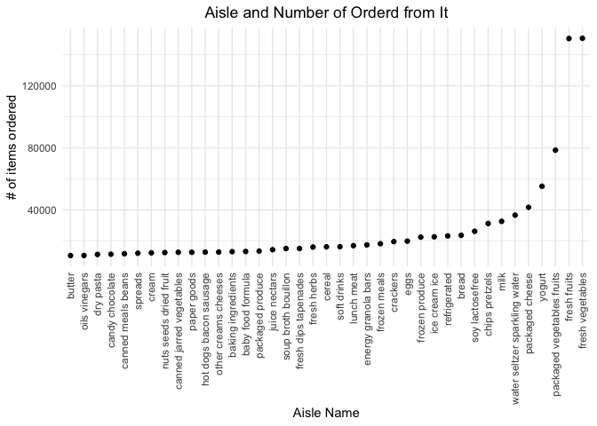

p8105_hw3_pw2551
================
Paula Wu
10/14/2021

Import the library:

``` r
library(tidyverse)
library(viridis)
library(p8105.datasets)
```

### Problem 1

Load in dataset

``` r
data("instacart")
```

``` r
# it would be easier to store this as a new variable
aisle = 
  instacart %>% 
  group_by(aisle_id) %>% 
  summarize(n_obs = n()) %>% 
  arrange(desc(n_obs))  # arrange in descending order
knitr::kable(aisle[1:10,])
```

| aisle_id |  n_obs |
|---------:|-------:|
|       83 | 150609 |
|       24 | 150473 |
|      123 |  78493 |
|      120 |  55240 |
|       21 |  41699 |
|      115 |  36617 |
|       84 |  32644 |
|      107 |  31269 |
|       91 |  26240 |
|      112 |  23635 |

There are 134 aisles. Aisle number 83 has the most item orders with
150609 observations, followed by aisle number 24 with 150473
observations. <br> <br> Making plots

``` r
aisle %>% 
  filter(n_obs > 10000) %>% 
  ggplot(aes(x = aisle_id, y = n_obs)) +
  geom_point()+
  geom_line()
```

<!-- -->
Make a table: best-selling

``` r
table_1 = 
  instacart %>% 
  filter(aisle == c("baking ingredients","dog food care", "packaged vegetables fruits")) %>% 
  group_by(product_name, aisle) %>% 
  summarize(times = n()) %>% 
  arrange(desc(times)) %>% 
  group_by(aisle) %>% 
  top_n(3) %>% 
  unite("products", c(product_name,times), sep = ": ") %>% # for better looking table
  mutate(rank = c(1,2,3)) %>% 
  pivot_wider(names_from = aisle, values_from = products)
```

    ## `summarise()` has grouped output by 'product_name'. You can override using the `.groups` argument.

    ## Selecting by times

``` r
knitr::kable(table_1)
```

| rank | packaged vegetables fruits | baking ingredients           | dog food care                                       |
|-----:|:---------------------------|:-----------------------------|:----------------------------------------------------|
|    1 | Organic Baby Spinach: 3324 | Light Brown Sugar: 157       | Organix Grain Free Chicken & Vegetable Dog Food: 14 |
|    2 | Organic Raspberries: 1920  | Pure Baking Soda: 140        | Organix Chicken & Brown Rice Recipe: 13             |
|    3 | Organic Blueberries: 1692  | Organic Vanilla Extract: 122 | Original Dry Dog: 9                                 |

Make a table: mean hour

``` r
table_2 = 
  instacart %>% 
  filter(product_name == c("Pink Lady Apples", "Coffee Ice Cream"))
```

    ## Warning in product_name == c("Pink Lady Apples", "Coffee Ice Cream"): longer
    ## object length is not a multiple of shorter object length

``` r
table_2
```

    ## # A tibble: 215 × 15
    ##    order_id product_id add_to_cart_order reordered user_id eval_set order_number
    ##       <int>      <int>             <int>     <int>   <int> <chr>           <int>
    ##  1    13887      17334                 4         1  159168 train               5
    ##  2    33963      17334                10         1  180434 train              54
    ##  3    61005       3798                 4         1   76283 train              17
    ##  4    67536       3798                 1         1  162096 train               5
    ##  5    76470       3798                 5         1  180560 train              61
    ##  6    82073       3798                 2         1   76641 train              20
    ##  7    90256       3798                 1         1   39853 train              46
    ##  8   129588       3798                12         0  176433 train              33
    ##  9   134443      17334                 4         0  108799 train              24
    ## 10   163919      17334                 3         1   12058 train               4
    ## # … with 205 more rows, and 8 more variables: order_dow <int>,
    ## #   order_hour_of_day <int>, days_since_prior_order <int>, product_name <chr>,
    ## #   aisle_id <int>, department_id <int>, aisle <chr>, department <chr>

### Problem 2

Load in data set

``` r
library(p8105.datasets)
data("brfss_smart2010")
```

Data Cleaning

``` r
brfss = 
  brfss_smart2010 %>% 
  janitor::clean_names() %>% 
  filter(topic == "Overall Health") %>% 
  filter(response %in% c("Excellent", "Very good", "Good", "Fair", "Poor")) %>%
  mutate(response = factor(response, levels = c("Excellent", "Very good", "Good", "Fair", "Poor"))) %>% 
  arrange(desc(response))
brfss
```

    ## # A tibble: 10,625 × 23
    ##     year locationabbr locationdesc  class  topic  question  response sample_size
    ##    <int> <chr>        <chr>         <chr>  <chr>  <chr>     <fct>          <int>
    ##  1  2010 AL           AL - Jeffers… Healt… Overa… How is y… Poor              45
    ##  2  2010 AL           AL - Mobile … Healt… Overa… How is y… Poor              66
    ##  3  2010 AL           AL - Tuscalo… Healt… Overa… How is y… Poor              35
    ##  4  2010 AZ           AZ - Maricop… Healt… Overa… How is y… Poor              62
    ##  5  2010 AZ           AZ - Pima Co… Healt… Overa… How is y… Poor              49
    ##  6  2010 AZ           AZ - Pinal C… Healt… Overa… How is y… Poor              30
    ##  7  2010 AR           AR - Benton … Healt… Overa… How is y… Poor              21
    ##  8  2010 AR           AR - Pulaski… Healt… Overa… How is y… Poor              36
    ##  9  2010 AR           AR - Washing… Healt… Overa… How is y… Poor              16
    ## 10  2010 CA           CA - Alameda… Healt… Overa… How is y… Poor              23
    ## # … with 10,615 more rows, and 15 more variables: data_value <dbl>,
    ## #   confidence_limit_low <dbl>, confidence_limit_high <dbl>,
    ## #   display_order <int>, data_value_unit <chr>, data_value_type <chr>,
    ## #   data_value_footnote_symbol <chr>, data_value_footnote <chr>,
    ## #   data_source <chr>, class_id <chr>, topic_id <chr>, location_id <chr>,
    ## #   question_id <chr>, respid <chr>, geo_location <chr>

2002 vs 2010:

``` r
brfss %>% 
  filter(year %in% c(2002, 2010)) %>% 
  arrange(year) %>% 
  select(year, locationabbr, locationdesc) %>% 
  group_by(year, locationabbr) %>% 
  summarize(n_obs = n()) %>% 
  filter(n_obs>=7)
```

    ## `summarise()` has grouped output by 'year'. You can override using the `.groups` argument.

    ## # A tibble: 81 × 3
    ## # Groups:   year [2]
    ##     year locationabbr n_obs
    ##    <int> <chr>        <int>
    ##  1  2002 AZ              10
    ##  2  2002 CO              20
    ##  3  2002 CT              35
    ##  4  2002 DE              15
    ##  5  2002 FL              35
    ##  6  2002 GA              15
    ##  7  2002 HI              20
    ##  8  2002 ID              10
    ##  9  2002 IL              15
    ## 10  2002 IN              10
    ## # … with 71 more rows

Data set limited to `Excellent`:

``` r
excellent = 
  brfss %>% 
  filter(response == "Excellent") %>%
  group_by(locationabbr, year) %>% 
  summarize(mean_data = mean(data_value, na.rm = TRUE)) %>% 
  select(year, locationabbr, mean_data)#, mean_data)
```

    ## `summarise()` has grouped output by 'locationabbr'. You can override using the `.groups` argument.

``` r
excellent
```

    ## # A tibble: 443 × 3
    ## # Groups:   locationabbr [51]
    ##     year locationabbr mean_data
    ##    <int> <chr>            <dbl>
    ##  1  2002 AK                27.9
    ##  2  2003 AK                24.8
    ##  3  2004 AK                23.0
    ##  4  2005 AK                23.8
    ##  5  2007 AK                23.5
    ##  6  2008 AK                20.6
    ##  7  2009 AK                23.2
    ##  8  2002 AL                18.5
    ##  9  2003 AL                19.5
    ## 10  2004 AL                20  
    ## # … with 433 more rows
