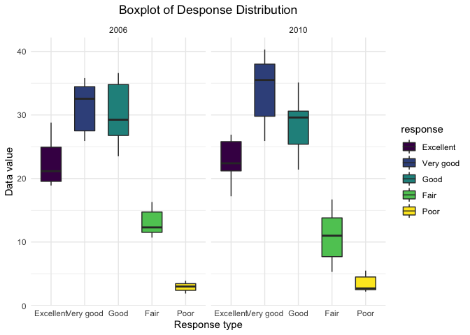

p8105_hw3_pw2551
================
Paula Wu
10/14/2021

Import the library:

``` r
library(tidyverse)
library(viridis)
library(p8105.datasets)
library(lubridate)
```

### Problem 1

Load in dataset

``` r
data("instacart")
```

``` r
# it would be easier to store this as a new variable
aisles = 
  instacart %>% 
  group_by(aisle_id, aisle) %>% 
  summarize(n_obs = n()) %>% 
  arrange(desc(n_obs))  # arrange in descending order
```

    ## `summarise()` has grouped output by 'aisle_id'. You can override using the `.groups` argument.

``` r
knitr::kable(aisles[1:5,])
```

| aisle_id | aisle                      |  n_obs |
|---------:|:---------------------------|-------:|
|       83 | fresh vegetables           | 150609 |
|       24 | fresh fruits               | 150473 |
|      123 | packaged vegetables fruits |  78493 |
|      120 | yogurt                     |  55240 |
|       21 | packaged cheese            |  41699 |

There are 134 aisles. Aisle number 83 (fresh vegetables) has the most
item orders with 150609 observations, followed by aisle number 24 (fresh
fruits) with 150473 observations. <br> <br> Making plots

``` r
instacart %>% 
  count(aisle) %>% 
  filter(n > 10000) %>% 
  mutate(aisle = fct_reorder(aisle, n)) %>%   # reorder the number of items in an acending order
  ggplot(aes(x = aisle, y = n)) +
  geom_point()+
  ggtitle("Aisle and Number of Orderd from It") +
  theme(axis.text.x = element_text(angle = 90, vjust = 0.5, hjust= 1),
        plot.title = element_text(hjust = 0.5)) +
  labs(y = "# of items ordered", x = "Aisle Name")
```

<!-- -->
<br>This graph shows the number of items ordered in each aisle (number
of items ordered \> 1000 for all aisles here). I reordered the graph so
that aisle with least number of items ordered is on the leftmost of the
x-axis and aisle with most number of items ordered is on the right of
the x-axis. “Butter” and “oils vinegars” aisles have relatively small
amount of orders; “fresh fruits” and “fresh vegetables” aisles have the
most orders. <br>

<br>Make a table: best-selling

``` r
table_1 = 
  instacart %>% 
  filter(aisle %in% c("baking ingredients","dog food care", "packaged vegetables fruits")) %>% 
  group_by(product_name, aisle) %>% 
  summarize(times = n()) %>% 
  arrange(desc(times)) %>% 
  group_by(aisle) %>% 
  top_n(3) %>% 
  unite("products", c(product_name,times), sep = ": ") %>% # for better looking table
  mutate(rank = c(1,2,3)) %>% 
  pivot_wider(names_from = aisle, values_from = products)
```

    ## `summarise()` has grouped output by 'product_name'. You can override using the `.groups` argument.

    ## Selecting by times

``` r
knitr::kable(table_1)
```

| rank | packaged vegetables fruits | baking ingredients     | dog food care                                     |
|-----:|:---------------------------|:-----------------------|:--------------------------------------------------|
|    1 | Organic Baby Spinach: 9784 | Light Brown Sugar: 499 | Snack Sticks Chicken & Rice Recipe Dog Treats: 30 |
|    2 | Organic Raspberries: 5546  | Pure Baking Soda: 387  | Organix Chicken & Brown Rice Recipe: 28           |
|    3 | Organic Blueberries: 4966  | Cane Sugar: 336        | Small Dog Biscuits: 26                            |

-   For “packaged vegetables fruits”, “Organic Baby Spinach” has the
    most orders (9784 orders), followed by “Organic Raspberries” (5546
    orders), and by “Organic Blueberries” (4966 orders).
-   For “baking ingredients”, “Light Brown Sugar” has the most orders
    (499 orders), followed by “Pure Baking Soda” (387 orders), and by
    “Cane Sugar” (336 orders)
-   For “dog food care”, “Snack Sticks Chicken & Rice Recipe Dog Treats”
    is the most popular one (30 orders), followed by “Organix Chicken &
    Brown Rice Recipe” (28 orders), and “Small Dog Biscuits” (26 orders)
-   It’s not surprising that these 9 items are ordered most from each
    aisle: baby spinach, raspberries, and blueberries are common
    household food; light brown sugar, baking soda, and cane sugar are
    key ingredients in baking; and dog treats are usually of small
    packages, so they sell really fast.<br>

<br>Make a table: mean hour

``` r
instacart %>% 
  filter(product_name == "Pink Lady Apples" | product_name == "Coffee Ice Cream") %>% 
  select(c(order_dow, order_hour_of_day, product_name)) %>% 
  mutate(order_day = wday(order_dow+1, label = TRUE, abbr = FALSE)) %>% 
  group_by(order_day, product_name) %>% 
  summarize(mean_hour = round(mean(order_hour_of_day),2)) %>%
  spread(key = order_day, value = mean_hour) %>% 
knitr::kable()
```

    ## `summarise()` has grouped output by 'order_day'. You can override using the `.groups` argument.

| product_name     | Sunday | Monday | Tuesday | Wednesday | Thursday | Friday | Saturday |
|:-----------------|-------:|-------:|--------:|----------:|---------:|-------:|---------:|
| Coffee Ice Cream |  13.77 |  14.32 |   15.38 |     15.32 |    15.22 |  12.26 |    13.83 |
| Pink Lady Apples |  13.44 |  11.36 |   11.70 |     14.25 |    11.55 |  12.78 |    11.94 |

In general, ice creams are bought in the later afternoon (around
14:30-16:00) from Mon-Thur and in the early afternoon (around
12:30-14:00) from Fri-Sun. On the other hand, Pink Lady Apples are
bought in early afternoon (around 11:00-14:30) during the whole week.
Moreover, the mean hour of the day on each day of the week for both
products is clustered between 11:00 - 16:00. This could be explained by
the fact that people usually have lunch break and are free during this
time period.<br>

#### Dataset description:

-   This instacart data set has 1384617 rows and 15 columns. Among these
    15 attributes, I think `days_since_prior_order` and `product_name`
    are important. `days_since_prior_order` indicates days between
    customers’ shopping cycle and retainability of customers. It has a
    mean of 17.0661259, thus customers usually order again in 17 days.
    `product_name` is important because it gives us information of what
    are the products ordered most frequently. The most ordered item is
    Banana and it has been ordered 18726 times during the period that
    the data is collected.

### Problem 2

Load in data set

``` r
data("brfss_smart2010")
```

Data Cleaning

``` r
# store the cleaned data to a new variable
brfss = 
  brfss_smart2010 %>% 
  janitor::clean_names() %>% 
  rename(state = locationabbr, county = locationdesc) %>% 
  separate(county, into = c("useless", "county"), sep = " - ") %>% 
  select(-useless) %>% 
  filter(topic == "Overall Health") %>% 
  filter(response %in% c("Excellent", "Very good", "Good", "Fair", "Poor")) %>%
  mutate(response = factor(response, levels = c("Excellent", "Very good", "Good", "Fair", "Poor"))) %>% 
  arrange(desc(response))
knitr::kable(brfss[1:5,])
```

| year | state | county            | class         | topic          | question                    | response | sample_size | data_value | confidence_limit_low | confidence_limit_high | display_order | data_value_unit | data_value_type  | data_value_footnote_symbol | data_value_footnote | data_source | class_id | topic_id | location_id | question_id | respid  | geo_location            |
|-----:|:------|:------------------|:--------------|:---------------|:----------------------------|:---------|------------:|-----------:|---------------------:|----------------------:|--------------:|:----------------|:-----------------|:---------------------------|:--------------------|:------------|:---------|:---------|:------------|:------------|:--------|:------------------------|
| 2010 | AL    | Jefferson County  | Health Status | Overall Health | How is your general health? | Poor     |          45 |        5.5 |                  3.5 |                   7.4 |             5 | %               | Crude Prevalence | NA                         | NA                  | BRFSS       | CLASS08  | Topic41  | NA          | GENHLTH     | RESP060 | (33.518601, -86.814688) |
| 2010 | AL    | Mobile County     | Health Status | Overall Health | How is your general health? | Poor     |          66 |        6.4 |                  4.4 |                   8.3 |             5 | %               | Crude Prevalence | NA                         | NA                  | BRFSS       | CLASS08  | Topic41  | NA          | GENHLTH     | RESP060 | (30.683993, -88.170637) |
| 2010 | AL    | Tuscaloosa County | Health Status | Overall Health | How is your general health? | Poor     |          35 |        4.2 |                  2.6 |                   5.7 |             5 | %               | Crude Prevalence | NA                         | NA                  | BRFSS       | CLASS08  | Topic41  | NA          | GENHLTH     | RESP060 | (33.214154, -87.520229) |
| 2010 | AZ    | Maricopa County   | Health Status | Overall Health | How is your general health? | Poor     |          62 |        3.5 |                  2.3 |                   4.6 |             5 | %               | Crude Prevalence | NA                         | NA                  | BRFSS       | CLASS08  | Topic41  | NA          | GENHLTH     | RESP060 | (33.493403, -112.04143) |
| 2010 | AZ    | Pima County       | Health Status | Overall Health | How is your general health? | Poor     |          49 |        5.7 |                  3.3 |                   8.0 |             5 | %               | Crude Prevalence | NA                         | NA                  | BRFSS       | CLASS08  | Topic41  | NA          | GENHLTH     | RESP060 | (32.216707, -110.96001) |

2002 vs 2010:

``` r
brfss %>% 
  filter(year %in% c(2002,2010)) %>%
  select(c(year, state, county)) %>% 
  group_by(year, state) %>% 
  summarize(distinct_counties = n_distinct(county)) %>% 
  filter(distinct_counties >= 7) %>% 
  arrange(year, distinct_counties) %>% 
  knitr::kable()
```

    ## `summarise()` has grouped output by 'year'. You can override using the `.groups` argument.

| year | state | distinct_counties |
|-----:|:------|------------------:|
| 2002 | CT    |                 7 |
| 2002 | FL    |                 7 |
| 2002 | NC    |                 7 |
| 2002 | MA    |                 8 |
| 2002 | NJ    |                 8 |
| 2002 | PA    |                10 |
| 2010 | CO    |                 7 |
| 2010 | PA    |                 7 |
| 2010 | SC    |                 7 |
| 2010 | OH    |                 8 |
| 2010 | MA    |                 9 |
| 2010 | NY    |                 9 |
| 2010 | NE    |                10 |
| 2010 | WA    |                10 |
| 2010 | CA    |                12 |
| 2010 | MD    |                12 |
| 2010 | NC    |                12 |
| 2010 | TX    |                16 |
| 2010 | NJ    |                19 |
| 2010 | FL    |                41 |

During 2002, CT, FL, NC, MA, NJ and PA were observed at 7 or more
distinct locations. During 2010, the number of states that were observed
at 7 or more locations increase to 14 states: CO, PA, SC, OH, MA, NY,
NE, WA, CA, MD, NC, TX, NJ, FL.<br>

Data set limited to `Excellent`:

``` r
excellent = 
  brfss %>% 
  filter(response == "Excellent") %>%
  group_by(state, year) %>% 
  summarize(mean_data = mean(data_value, na.rm = TRUE))
```

    ## `summarise()` has grouped output by 'state'. You can override using the `.groups` argument.

``` r
knitr::kable(excellent[1:5,])  # just show the first five rows
```

| state | year | mean_data |
|:------|-----:|----------:|
| AK    | 2002 |     27.90 |
| AK    | 2003 |     24.85 |
| AK    | 2004 |     23.05 |
| AK    | 2005 |     23.85 |
| AK    | 2007 |     23.50 |

For each state, there’s a variable `mean_data` that represents mean of
`data_value` across locations every year.<br> <br>Make a spaghetti plot:

``` r
ggplot(excellent, aes(x = year, y = mean_data, group = state, color = state)) + 
  geom_line(alpha = 0.6) +
  ggtitle("Mean Data_value for Each State Acorss Years") +
  theme(plot.title = element_text(hjust = 0.5)) +
  labs(y = "mean of data_value", x = "year", color = "State Abbreviation")
```

<!-- -->
<br>There seems to be a trend from 2002 to 2010 across states that on
average less people answer “Excellent” to the question asking about
their overall health status. Also, the mean data_value seems to
fluctuate from year to year in many states. <br>

<br>Distribution of `data_value` for responses

``` r
brfss %>% 
  filter(state=="NY" & year %in% c(2006, 2010)) %>% 
  arrange(year) %>% 
  ggplot(aes(x = response, y = data_value, fill = response)) + 
  geom_boxplot(width = 0.6) +
  ggtitle("Boxplot of Desponse Distribution") +
  theme(plot.title = element_text(hjust = 0.5)) +
  labs(y = "Data value", x = "Response type") +
  facet_grid(.~year)
```

<!-- -->
<br> - In both graphs, we can see that people in NY who took the survey
have similar distribution of responses: a large proportion of people
think their overall health is “Very good” or “Good”, followed by a
relatively smaller proportion of people who think their overall health
is “Excellent”, then by “Fair” and “Poor”. <br> - The difference between
2006 and 2010 is that, in 2010, more people seems to rate their overall
health status to be “Very good”. Also, for the “Fair” response, we can
see that there’s a wider range of responses across the NY population,
since the IQR of the “Fair” boxplot in 2010 is larger than that in 2006.
<br>

### Problem 3

Loading and tidying data

``` r
accel = read_csv("./data/accel_data.csv") %>% 
  janitor::clean_names() %>% 
  pivot_longer(activity_1:activity_1440, names_to = "minute", names_prefix = "activity_",values_to = "values") %>% 
  mutate(minute = as.numeric(minute),
         day = as.factor(day),
         type_of_days = ifelse(day %in% c('Sunday', 'Saturday'), 'weekend', 'weekday'),
         day = fct_relevel(day, "Sunday", "Monday", "Tuesday", "Wednesday", "Thursday", "Friday", "Saturday"))
knitr::kable(accel[1:5,])
```

| week | day_id | day    | minute |   values | type_of_days |
|-----:|-------:|:-------|-------:|---------:|:-------------|
|    1 |      1 | Friday |      1 | 88.37778 | weekday      |
|    1 |      1 | Friday |      2 | 82.24444 | weekday      |
|    1 |      1 | Friday |      3 | 64.44444 | weekday      |
|    1 |      1 | Friday |      4 | 70.04444 | weekday      |
|    1 |      1 | Friday |      5 | 75.04444 | weekday      |

-   I changed the data into a longer-format, with each row being the
    observation of one minute. And I also added one column named
    `type_of_days` to indicate whether it’s weekday or weekends. The
    final dataset has the following dimension: 50400 observations (rows)
    and 6 attributes (columns).
-   Here are the names of the attributes in the final dataset: week,
    day_id, day, minute, values, type_of_days. Attribute `minute`
    indicated the minute of the day, and has a range between 1 and 1440,
    while `values` are the activities during each minute. <br>
-   I later changed the type of variable `minute` to numeric, and
    variable `day` to factor.

<br>Traditional analyses

``` r
traditional = 
  accel %>% 
  group_by(day, week) %>% 
  summarize(total_activity = sum(values))
```

    ## `summarise()` has grouped output by 'day'. You can override using the `.groups` argument.

``` r
# for display
traditional %>% 
  pivot_wider(names_from = day, values_from = total_activity) %>% 
  knitr::kable()
```

| week | Sunday |    Monday |  Tuesday | Wednesday | Thursday |   Friday | Saturday |
|-----:|-------:|----------:|---------:|----------:|---------:|---------:|---------:|
|    1 | 631105 |  78828.07 | 307094.2 |    340115 | 355923.6 | 480542.6 |   376254 |
|    2 | 422018 | 295431.00 | 423245.0 |    440962 | 474048.0 | 568839.0 |   607175 |
|    3 | 467052 | 685910.00 | 381507.0 |    468869 | 371230.0 | 467420.0 |   382928 |
|    4 | 260617 | 409450.00 | 319568.0 |    434460 | 340291.0 | 154049.0 |     1440 |
|    5 | 138421 | 389080.00 | 367824.0 |    445366 | 549658.0 | 620860.0 |     1440 |

It would be more straightforward we put all the data into a graph

``` r
traditional %>% 
  ggplot(aes(x = day, y = total_activity, group = week, color = as.factor(week))) + 
  geom_line() + 
  ggtitle("Activity Trend over A Week") +
  theme(plot.title = element_text(hjust = 0.5)) +
  labs(y = "Total activity", x = "Day of the Week", color = "Week Number")
```

<!-- -->
<br> We can see from the graph above that Friday, Saturday in earlier
weeks and Sunday have more total activities than the weekdays. Total
activities during Tuesday, Wednesday and Thursday remain stable (around
4 \* 10<sup>5</sup>) across weeks. Total activities for the week-4 and
week-5 Saturday and week-1 Monday are extremely small, while total
activities for the week-3 Monday are considerably large. <br>

<br>Day across the week

``` r
accel %>% 
  ggplot(aes(x = minute, y = values, group = day_id, color = day))+
  geom_line(alpha = 0.3) + 
  geom_smooth(se = FALSE, aes(group = day))
```

    ## `geom_smooth()` using method = 'gam' and formula 'y ~ s(x, bs = "cs")'

<!-- -->
<br> After smoothing across day of the week, we can see that this person
is least active during midnight and early morning (roughly between 12
a.m. and 6:30 a.m.), possibly due to sleeping. Two significant peaks
appear on Sunday morning (around 11 a.m.) and Friday late night (around
9 p.m.). Other than that, the activities are similar during the middle
of the day across different days of the week.
